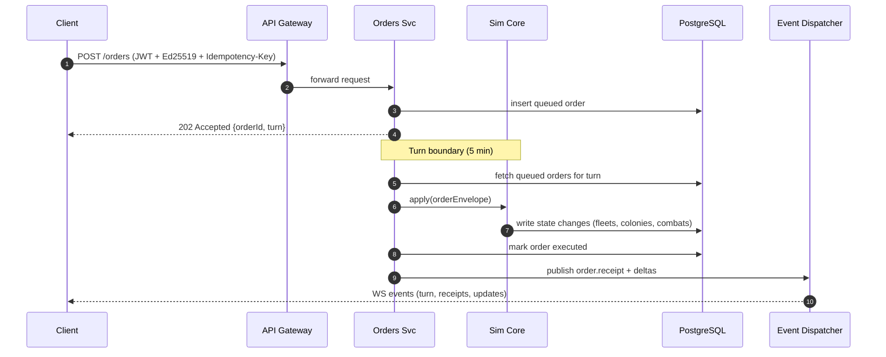
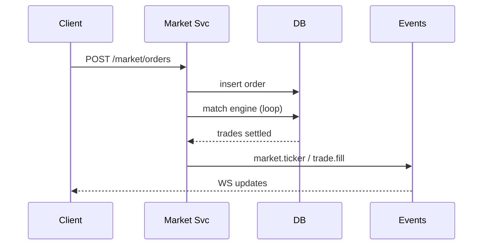
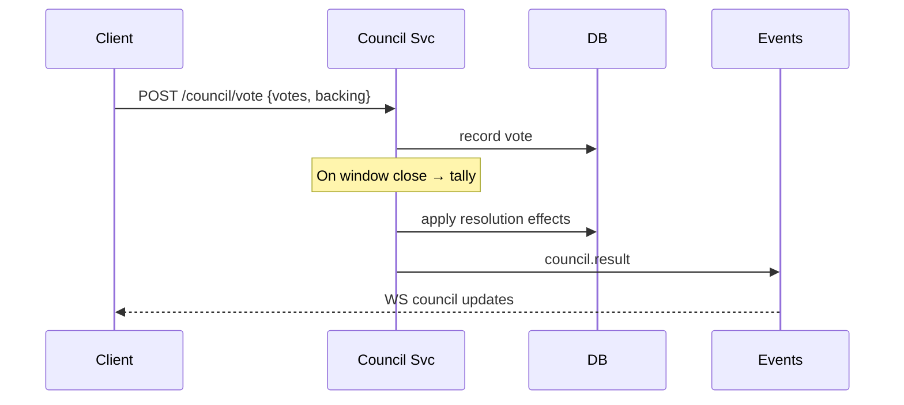

# File: /docs/space4x/system-architecture-and-erd.md

**Purpose:** End‑to‑end architecture + ERD for the Space 4X MMO prototype → production. This spec is written for your Augment Code assistant in VS Code to scaffold services and storage with **zero license cost**. It links the PRD, GDD, and OpenAPI v1 already produced.

**Links/Dependencies:**

* PRD: `/docs/space4x/prd.md` (conceptual — from chat)
* GDD: `/docs/space4x/gdd.md` (conceptual — from chat)
* API: `/apis/space4x/openapi-v1.yaml` (OpenAPI 3.1)

---

## 1) Tech Stack (Prototype → Production, zero license cost)

**Client (3D game):** Godot 4 (MIT, free) — GDScript/C#.

**Prototype Server (fast to code):** Node.js + TypeScript (Express/Fastify) with WebSocket (ws) or Colyseus (OSS). PostgreSQL 16.

**Production Server (scalable):** Rust (Axum/Actix) **or** Go (Echo/fasthttp). PostgreSQL 16. Object storage (S3‑compatible, e.g., MinIO). Messaging: NATS (OSS) for events. Observability: Prometheus + Grafana + Loki (OSS).

**Why:** All components are open‑source (MIT/Apache/BSD) → **no licensing fee**. Optional costs would only be cloud hosting.

**Migration rule:** Keep a **pure deterministic Sim Core** in Rust (crate) or Go library. Prototype binds via WASM; production links natively. Services call Sim Core for validation and turn resolution.

---

## 2) High‑Level Architecture

```mermaid
graph TD
  subgraph Client
    A[Godot 4 Client<br/>C#/GDScript]
  end
  subgraph Edge
    G[API Gateway<br/>(REST/WS, rate limit)]
  end
  subgraph Core Services
    O[Orders Service]
    F[Fleets Service]
    C[Colonies Service]
    S[Systems Service]
    T[Tech Service]
    M[Market Service]
    U[Council & Diplomacy]
    L[Legacy Service]
    E[Event Dispatcher]
    SIM[Sim Core<br/>(Rust crate)]
  end
  subgraph Data Layer
    PG[(PostgreSQL)]
    OBJ[(Object Storage<br/>Snapshots)]
    BUS[(NATS Event Bus)]
  end

  A <--> G
  G --> O & F & C & S & T & M & U & L
  O --> SIM
  F --> SIM
  C --> SIM
  T --> SIM
  M --> PG
  U --> PG
  O --> PG
  F --> PG
  C --> PG
  S --> PG
  L --> PG
  SIM --> PG
  E <--> BUS
  O --> E
  F --> E
  M --> E
  U --> E
  E --> A
  SIM --> OBJ
```

**Description:**

* **API Gateway** terminates TLS, enforces CORS/CSP, and rate limits.
* **Services** own bounded contexts; they write intents to PG, publish events to NATS, call **Sim Core** for deterministic resolution.
* **Event Dispatcher** multiplexes server → client WebSocket topics (turn ticks, combat reports, market ticks).
* **Object Storage** persists hourly snapshots (binary FlatBuffers) for fast restore.

---

## 3) Services & Responsibilities

> Each function below maps to concrete endpoints in `/apis/space4x/openapi-v1.yaml`. Keep services thin; heavy rules live in **Sim Core**.

### 3.1 Orders Service

* **Purpose:** Validate, sign, queue, and schedule orders for macro‑turn execution.
* **Key functions:**

  * `submitOrder(envelope)` — verify JWT + Ed25519, idempotency; write to `orders`.
  * `turnScheduler()` — every 5 min: pull queued orders, call `SimCore.apply()`.
  * `receipts()` — emit `order.receipt` + execution status via WS.

### 3.2 Fleets Service

* **Purpose:** Fleet CRUD, movement planning, stance, combat hooks.
* **Key functions:**

  * `planPath(fleetId, path, rules)` — validate hyperlane, supply.
  * `resolveMovement(turn)` — Sim Core path step; publish `fleet.moved`.
  * `combatStart/resolve` — Sim Core deterministic combat; write battle report blobs to OBJ.

### 3.3 Colonies Service

* **Purpose:** Colony mgmt, improvements, terraforming pipelines.
* **Key functions:** `createImprovement`, `applyTerraformStep`, `computeYields`.

### 3.4 Systems Service

* **Purpose:** Star/system catalog, intel levels, ownership changes.
* **Key functions:** `recalculateInfluence()`, `transferOwnership()`.

### 3.5 Tech Service

* **Purpose:** Tech tree exposure, research progress, TRD purchases.
* **Key functions:** `startResearch(techId)`, `buyTech(TRD)`.

### 3.6 Market Service

* **Purpose:** Galactic Exchange, bilateral deals, trade routes.
* **Key functions:**

  * `placeOrder(symbol, side, qty, price)`
  * `matchEngine()` — per‑turn batch or continuous; updates `market_trades`.
  * `tradeRoutes()` — compute TRD per route; handle piracy/blockades.

### 3.7 Council & Diplomacy

* **Purpose:** Proposals, votes, treaties, war states.
* **Key functions:** `propose(resolution)`, `vote(resId, votes, backing)`, `applyResolution()`.

### 3.8 Legacy Service

* **Purpose:** Account‑level progression; artifacts vault; chronicles.
* **Key functions:** `awardLegacy(points)`, `recordMonument()`, `bindArtifact()`.

### 3.9 Event Dispatcher

* **Purpose:** Topic fan‑out over WS (turns, combat, market, council).
* **Key functions:** `subscribe(topics)`, `push(event)`.

---

## 4) Data Flow (Sequence Diagrams)

### 4.1 Submit Order → Execute on Turn



### 4.2 Fleet Movement & Combat

```mermaid
sequenceDiagram
  participant Client
  participant F as Fleets Svc
  participant SIM as Sim Core
  participant PG as DB
  participant E as Events

  Client->>F: POST /orders/move {fleetId, path}
  F->>PG: queue movement order
  Note over F,SIM: On turn
  F->>SIM: resolveMovement()
  SIM->>PG: update fleet position; create combat if contact
  SIM->>PG: write combat report
  F->>E: publish fleet.moved / combat.report
  E-->>Client: WS events
```

### 4.3 Market Order & Match



### 4.4 Council Vote



---

## 5) Database Schema — ERD

```mermaid
erDiagram
  players ||--o{ empires : owns
  players ||--o{ legacy_progress : earns
  empires ||--o{ fleets : fields
  empires ||--o{ colonies : governs
  systems ||--o{ colonies : hosts
  systems ||--o{ system_intel : has
  fleets ||--o{ ships : composed_of
  fleets ||--o{ fleet_orders : queued
  orders ||--o{ order_receipts : yields
  colonies ||--o{ improvements : builds
  tech_nodes ||--o{ tech_edges : links
  empires ||--o{ tech_progress : researches
  market_orders ||--o{ market_trades : fills
  trade_routes ||--o{ piracy_events : suffers
  councils ||--o{ resolutions : proposes
  resolutions ||--o{ votes : collects

  players {
    string id PK
    string email
    string display_name
    string pubkey_ed25519
    datetime created_at
  }
  empires {
    string id PK
    string owner_player_id FK
    string name
    string banner
    jsonb policies
    datetime created_at
  }
  systems {
    string id PK
    string name
    jsonb position_xyz
    string owner_empire_id FK
  }
  colonies {
    string id PK
    string system_id FK
    string empire_id FK
    int pop
    int habitability
    jsonb yields
  }
  fleets {
    string id PK
    string empire_id FK
    string system_id FK
    string stance
    int supply
  }
  ships {
    string id PK
    string fleet_id FK
    string hull
    int count
  }
  orders {
    string id PK
    string empire_id FK
    string kind
    jsonb payload
    int target_turn
    string idem_key UNIQUE
    string status
    datetime created_at
  }
  order_receipts {
    string id PK
    string order_id FK
    string status
    jsonb result
  }
  tech_nodes {
    string id PK
    string branch
    int base_cost_knw
    jsonb effects
  }
  tech_edges {
    string from FK
    string to FK
  }
  tech_progress {
    string empire_id FK
    string tech_id FK
    int invested_knw
    bool unlocked
  }
  market_orders {
    string id PK
    string empire_id FK
    string symbol
    string side
    string type
    numeric qty
    numeric price
    string status
  }
  market_trades {
    string id PK
    string buy_order_id FK
    string sell_order_id FK
    numeric qty
    numeric price
    datetime at
  }
  trade_routes {
    string id PK
    string origin_system_id FK
    string dest_system_id FK
    string empire_id FK
    numeric trd_per_turn
    string status
  }
  piracy_events {
    string id PK
    string route_id FK
    string kind
    numeric loss
    datetime at
  }
  councils {
    string id PK
    datetime window_start
    datetime window_end
  }
  resolutions {
    string id PK
    string council_id FK
    string title
    string text
    jsonb effects
  }
  votes {
    string id PK
    string resolution_id FK
    string empire_id FK
    int votes
    jsonb backing
  }
  legacy_progress {
    string player_id FK
    int points
    jsonb unlocked_nodes
  }
  system_intel {
    string id PK
    string system_id FK
    string empire_id FK
    string level
  }
```

**Notes:** Use PostgreSQL `jsonb` sparingly for flexible fields (effects, policies), but keep core relations normalized for queries.

---

## 6) Event Sourcing, Snapshots, Determinism

* **Event log:** `orders` + `order_receipts` + domain events; append‑only.
* **Snapshots:** Hourly FlatBuffers dumped to object storage; on crash, load latest snapshot → replay events.
* **Determinism:** Sim Core uses seeded RNG per sector + turn; stable iteration order; no wall clock in logic.

---

## 7) Security & Web Policies

* **Auth:** JWT in **localStorage** (as per your rule). Server returns tokens **only in JSON** — **no cookies**.
* **Ed25519 signatures** on all mutating orders (headers: `X-Signature-Ed25519`, `X-Public-Key`).
* **CORS:** Allow only game domain origins; `OPTIONS` preflight; restrict methods.
* **CSP (example):**

  * `default-src 'self'`
  * `script-src 'self' 'wasm-unsafe-eval'` (if WASM Sim is used)
  * `connect-src https://api.game.example.com wss://api.game.example.com`
  * `img-src 'self' data:`
  * `style-src 'self' 'unsafe-inline'` (only if needed for engine UI)
* **Rate limits:** Per IP & per empire; order quotas per turn.

---

## 8) Deployment Topology & Scaling

* **Pods:** API Gateway (2x), Orders (2–4x), Fleets (2–4x), Market (2x), Council (1–2x), Tech (1–2x), Colonies (2x), Legacy (1x), Event Dispatcher (2x), NATS (3x), Postgres primary + 2 replicas, MinIO 3‑node.
* **HPA:** Scale by queue depth + WS sessions.
* **Regions:** Start 1 region; later add sector‑affinity sharding.

---

## 9) CI/CD & Testing

* **CI:** Build per service; run unit + property tests; OpenAPI contract tests; replay determinism tests (golden saves).
* **CD:** Progressive rollout (25% → 50% → 100%); auto‑rollback on error budget burn.
* **Load tests:** Synthetic players sending 3–5k commands/min; verify turn deadlines.

---

## 10) Zero‑Downtime Migrations

* Use **expand/contract** pattern: add nullable columns → backfill → switch code → drop old.
* Schema migrations with `sqitch` or `golang-migrate`/`sqlx` → tracked per service.

---

## 11) Implementation Tasks (Augment Code‑ready)

1. Scaffold `api-gateway` (Fastify) with JWT middleware, CORS/CSP, request logging.
2. Scaffold `orders-svc` (TypeScript) with PG tables (`orders`, `order_receipts`), idempotency, and a stub `SimCore.apply`.
3. Implement `event-dispatcher` (Node ws) subscribing to NATS topics and broadcasting WS frames per `/v1/stream` contract.
4. Implement `fleets-svc` CRUD and `/orders/move` endpoint; write minimal path validator.
5. Implement `market-svc` basic order book (price‑time priority) + `/market/ticker`.
6. Implement `council-svc` minimal session with proposal + vote tally.
7. Provision PostgreSQL with the ERD tables; write `sql/001_init.sql`.
8. Add `docker-compose` for local: PG, NATS, api, services — one‑command run.
9. Add **WASM Sim Core** stub (Rust) returning deterministic mock deltas for now.
10. Wire Godot client to login, list fleets/systems, submit a move order, subscribe to WS.

---

**Result:** This document plus the OpenAPI spec gives your AI coding assistant everything needed to generate the first runnable end‑to‑end slice (login → submit order → turn tick → WS update) with **no license costs** and a clear path to production.
